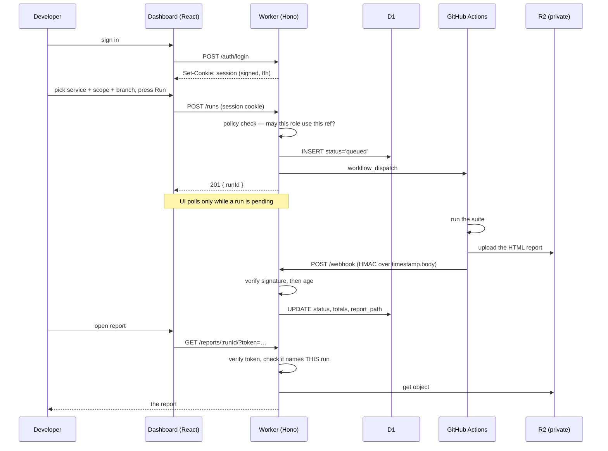

# Architecture

Four surfaces, each with a different caller, authenticated differently because
they are trusted differently.

## The whole flow



The run row is written **before** GitHub is called. A run that fails to dispatch
is still a run someone asked for, and it should appear with its error rather
than vanish.

## The contract with the suite

Two repositories, no shared code, meeting at exactly three points. Nothing but
tests stops them drifting — and they had drifted: this dashboard sent a service
name in a workflow input that only accepts package names, and the workflow had
no callback step at all. Both repos' docs claimed the integration worked.

**Dispatch — what this sends:**

| Input     | Value                                        | Note                                             |
| --------- | -------------------------------------------- | ------------------------------------------------ |
| `run_id`  | the run id created here                      | The callback names it, or the result is orphaned |
| `scope`   | the chosen service, or the tag when it's all | The workflow greps `@<scope>`; services are tags |
| `style`   | `both`                                       | Which package to run — not this dashboard's axis |
| `workers` | a **string**                                 | GitHub accepts nothing else                      |

`scope` and `style` are the workflow's names, not this dashboard's, and they do
not line up with its vocabulary. That mismatch is the whole reason the tests in
[`integration-contract.test.ts`](../packages/api/test/integration-contract.test.ts)
exist: they pin the workflow's accepted values as a hand-copied list, so a
change on either side surfaces here rather than as a 422 from GitHub.

**Callback — what comes back:**

```json
{
  "runId": "…",
  "status": "passed",
  "total": 80,
  "passed": 80,
  "failed": 0,
  "suiteVersion": "1.0.0",
  "suiteSha": "…",
  "reportPath": "runs/…/index.html",
  "workflowUrl": "https://github.com/…/actions/runs/…"
}
```

Signed over `timestamp.body` with a shared secret, and the workflow sends it
whether the suite passed or failed — a red run that never reports leaves the
dashboard showing `running` forever.

`suiteVersion` and `suiteSha` say which tree produced the result. The version is
what someone quotes; the sha is the only thing that identifies what actually ran,
and most runs happen between releases.

The workflow skips the callback entirely when `run_id` is empty, which is what
a hand-started run looks like. Nobody asked, so there is nobody to tell.

**Report upload — the third crossing.** The workflow writes the built report
straight into this deployment's R2 bucket under `runs/{run_id}/`, using a token
scoped to that one bucket, and only then claims `reportPath` in the callback. It
does not POST the bytes here: an endpoint accepting several megabytes needs a
body limit, a parser and a signing scheme over something too big to buffer, all
to reach a bucket the job can already write to. See
[decision 14](decisions.md#14-one-real-allure-report-shared-by-every-simulated-run).

## Why each surface authenticates differently

| Surface            | Caller                 | Authentication                | Why                                                             |
| ------------------ | ---------------------- | ----------------------------- | --------------------------------------------------------------- |
| `POST /auth/login` | a person               | password → role               | The only place a secret is exchanged                            |
| `POST /runs`       | the dashboard          | session cookie + policy       | Needs to know _who_, to decide what they may run                |
| `GET /runs`        | the dashboard, polling | session cookie, scoped in SQL | Needs to know who, to decide what they may see                  |
| `POST /webhook`    | the workflow           | HMAC over `timestamp.body`    | The only endpoint that can change a result                      |
| `GET /reports/*`   | a browser tab          | signed run-scoped token       | Asset requests cannot carry a header                            |
| `GET /gate`        | the dashboard          | session cookie                | Readable by the role it restricts, so a refusal explains itself |
| `PUT /gate`        | an admin               | session cookie + role         | Pauses developer runs without editing anyone's role             |

The webhook is the one worth attacking: it writes the numbers the dashboard
displays. Anyone who learned a run id and could post unsigned would be able to
mark a failing run green. So it is the one that is signed.

## The three questions authorisation answers

`src/policy.ts` is the only place these are decided:

```
1. may this role start a run?        →  POLICIES[role]
2. against which refs?               →  mayUseRef(role, ref)
3. which runs may it then see?       →  visibilityClause(role)   ← SQL fragment
```

Question 3 returns a **SQL fragment**, not a predicate. The database must never
hand back a row the caller may not see — filtering after the query is a
convention, not a restriction, and it breaks under `LIMIT` besides. See
[decision 3](decisions.md#3-visibility-is-enforced-in-sql-never-in-the-handler).

|             | `demo`                   | `dev`                   | `qa`                         | `admin`                 |
| ----------- | ------------------------ | ----------------------- | ---------------------------- | ----------------------- |
| Branches    | `main`                   | `main`                  | `main`, `develop`, `release` | any                     |
| Max workers | 2                        | 4                       | 8                            | 16                      |
| Sees        | its own runs only        | main-branch runs        | every run                    | every run               |
| May delete  | no                       | no                      | no                           | yes                     |
| Dispatches  | never (always simulated) | per `SIMULATE_DISPATCH` | per `SIMULATE_DISPATCH`      | per `SIMULATE_DISPATCH` |

A run the caller may not see returns **404, not 403** — telling a developer that
a run exists but is off-limits leaks the branch names they were scoped away
from.

## Local versus deployed

Everything has a local implementation, so the repo runs with no account:

|          | Local (`pnpm dev`)             | Deployed                   |
| -------- | ------------------------------ | -------------------------- |
| D1       | SQLite file under `.wrangler/` | Cloudflare D1              |
| R2       | a directory                    | Cloudflare R2              |
| Dispatch | simulated in-process           | `workflow_dispatch`        |
| Result   | the simulator writes it        | the workflow posts it back |
| Secrets  | obviously fake defaults        | `wrangler secret put`      |

`SIMULATE_DISPATCH` is the switch, and it defaults to **on** so the safe
behaviour is the default. The same flag decides whether the login screen prints
dev/qa/admin's passwords. See
[decision 6](decisions.md#6-simulation-is-the-default-and-one-flag-governs-it).
`/demo/preview-role` is not gated by this flag at all — see
[decision 12](decisions.md#12-a-fourth-role-that-can-never-dispatch-for-real).

## Data model

One table. The id is human-readable on purpose —
`20260826-1430-items-k3f9` sorts chronologically, says what it covered, and
doubles as the R2 prefix for that run's report. A UUID would need a second
column to answer "when was this and what did it cover?", which is the question
anyone scanning the list is actually asking.

The random suffix is not decoration: without it, two runs of the same service in
the same minute collide on the PRIMARY KEY. That was a real 500 — see
[decision 9](decisions.md#9-the-bugs-the-tests-actually-found).

## Polling

The UI polls `GET /runs` only while at least one run is pending, and stops when
none are. A dashboard left open on a Friday afternoon should not still be
hitting the API on Monday.

The alternative — a WebSocket or SSE — is the right answer at a size this is not.
Runs finish in minutes and a handful of people watch at once.
